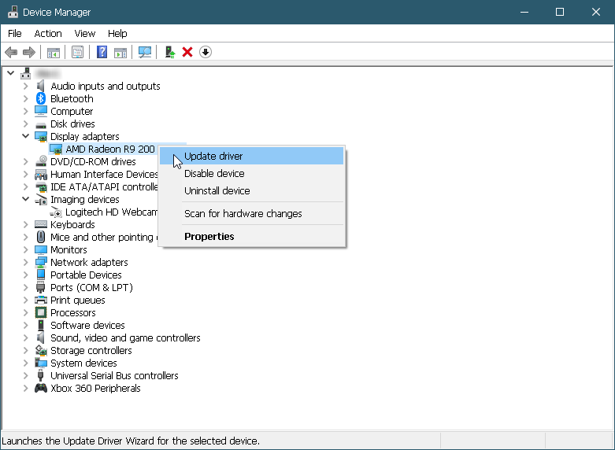
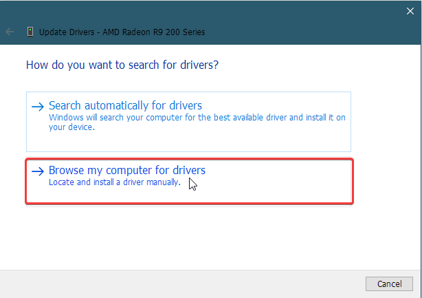
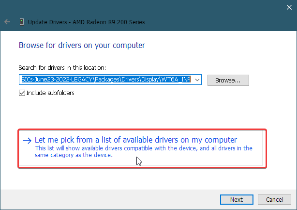
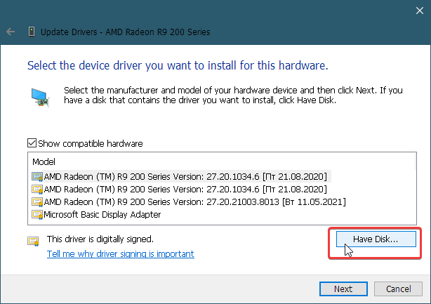
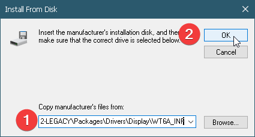
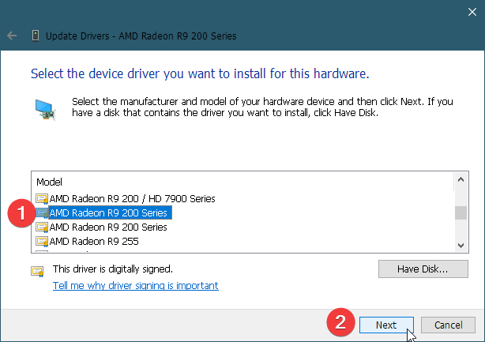
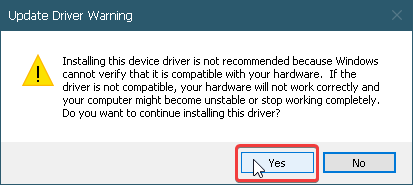
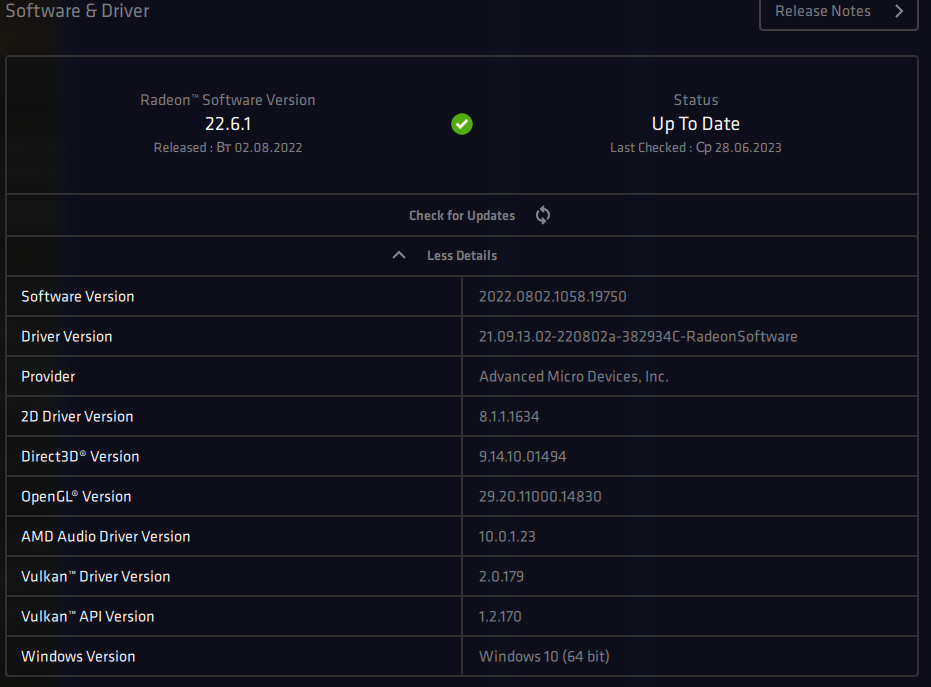

# AMD Radeon R9 270 vs Adrenalin 22.6.1 Drivers

For some reason some AMD Radeon R9 270 cards aren't recognized by the latest legacy drivers from AMD (it throws "error 182 - no compatible device found"). It seems AMD has forgot to add some hardware IDs in this release and doesn't bother to fix it. Here you can find a way how to install the drivers.

**DISCLAMER! You do the actions below at you own risk. I can confirm that they have helped me to install the drivers but I haven't done any extensive testing for this. If you don't feel able to recover after an unsuccessful installation, better find someone who does first.**

1. The drivers itself are [here](https://www.amd.com/en/support/graphics/amd-radeon-r9-series/amd-radeon-r9-200-series/amd-radeon-r9-270)

2. After running it first time (and getting the mentioned error) go to the folder `C:\AMD\Radeon-Software-Adrenalin-2020-22.6.1-Win10-Win11-64Bit-LegacyASICs-June23-2022-LEGACY\Config`

3. Put `InstallManifest.json`[file from this repository](./Config/InstallManifest.json) into this folder and overwrite the existing file. The file contains additional hardware IDs from a previous version 21.5.2.

4. Now go to one folder up (`C:\AMD\Radeon-Software-Adrenalin-2020-22.6.1-Win10-Win11-64Bit-LegacyASICs-June23-2022-LEGACY`) and run `setup.exe`

5. This time the installation will go much better and it will install almost everything except the drivers itself (this time you'll get error 205 at the end). But don't worry, we'll fix it soon.

Since drivers files are signed and cannot be modified we can't do here the same trick as with `InstallManifest.json`. So we're going to install them manually.

1. Open the Device Manager

2. Find your video card here and start a driver update for it

3. Click `Browse my computer for drivers`

4. Click `Let me pick from a list...`

5. Click `Have disk`

6. Paste `C:\AMD\Radeon-Software-Adrenalin-2020-22.6.1-Win10-Win11-64Bit-LegacyASICs-June23-2022-LEGACY\Packages\Drivers\Display\WT6A_INF` into the `Copy manufacturer's files from`field and click OK.
   

7. In the list find `AMD Radeon R9 200 series` (there will be two entries, you can select any of them) and click Next
   

8. Click `Yes` in the warning
   

9. The installation will start, a screen will flicker a bit and at the end it should say that the installation is successful

10. Reboot the PC

That's all!

